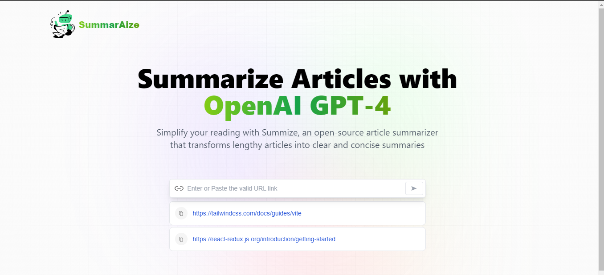

# AI-Article-Summarizer
# Overview
I've developed an AI-powered article summarizer using modern web technologies. This project utilizes React.js for building the user interface, leveraging JavaScript concepts for functionality, and Tailwind CSS for an interactive UI design.

# Features
1. Article Summarization: The application provides the functionality to summarize articles using the ChatGPT API.
2. Redux Toolkit Integration: Redux Toolkit is used to manage the application state, providing a centralized store for data management.
3. Reducer and Slice Implementation: The app makes use of reducers and slice reducers to efficiently manage different aspects of state within the application.
4. Local Storage: Previous search URLs are stored locally, allowing users to access and reuse past searches. Users can also click on a copy button to paste old URLs into the input field for revisiting.

# Technologies Used
1. Frontend Library: React.js
2. Styling: Tailwind CSS
3. API Integration: ChatGPT API
4. State Management: Redux Toolkit

# Usage
To use the article summarizer:
1. Input the URL of the article you want to summarize.
2. Click the button to generate a summary.

# Usage
To use the article summarizer:
1. Input the URL of the article you want to summarize.
2. Click the summarization button to generate a summary.
# Installation
To run the project locally:
1. Clone the repository.
2. Install dependencies using npm install.
3. Start the development server with npm start.
# Contributing
Contributions are welcome! If you'd like to contribute to the project, feel free to submit a pull request or open an issue.
